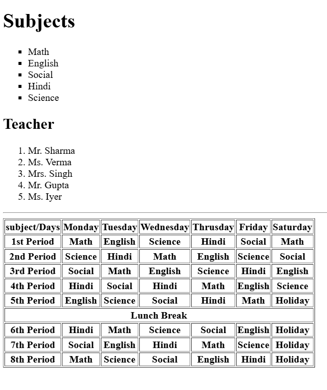

📘 HTML Basics
1. What is HTML?

HTML (HyperText Markup Language) is the standard language used to create websites and web pages.
It uses tags and elements to define the structure of a webpage and to display text, images, links, and other content.

HTML is divided into two main parts:

🔹 HyperText

Refers to the ability to create links that connect one webpage to another.

🔹 Markup Language

Refers to the use of tags to define and structure content within a webpage.

2. Difference Between HTML and HTML5
Feature	HTML	HTML5
Version	Older version	Latest version
Mobile Friendly	Less mobile-friendly	More mobile-friendly
Drag and Drop	Not supported	Supported
JavaScript	Does not support background JS execution	Supports background execution using Web Workers
Data Storage	Uses cookies for temporary data	Uses SQL databases, Local Storage, and Application Cache
Multimedia Support	Requires Flash Player for audio and video	Native support using <audio> and <video> tags

📌 Summary

HTML is used to build the structure of webpages.

HTML5 introduces modern features like multimedia support, offline storage, and improved performance.

HTML5 is designed for better user experience, especially on mobile devices.

****